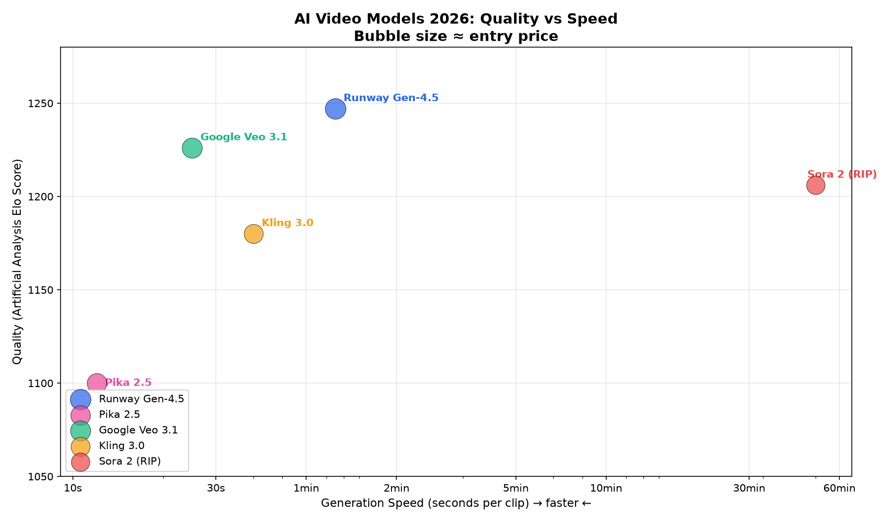

# AI Video Models — Quality vs Speed vs Cost

This chart compares the major AI video generation models across three dimensions: quality (Elo score from Artificial Analysis leaderboard), generation speed, and entry price.

## Interpretation

- **Top-right (high quality, fast)**: Google Veo 3.1 — best balance of quality and speed
- **Top-left (high quality, slow)**: Runway Gen-4.5 — best quality but slower generation
- **Bottom-right (decent quality, fastest)**: Pika 2.5 — speed leader by a wide margin
- **Top-center**: Kling 3.0 — strong quality at moderate speed, native 4K
- **Far left (discontinued)**: Sora — historically top quality but impractically slow

## Key insight

No single model dominates all three dimensions. The optimal strategy is using multiple models: Pika for rapid iteration and social content, Runway for production deliverables, Veo for narrative/audio-driven projects.
